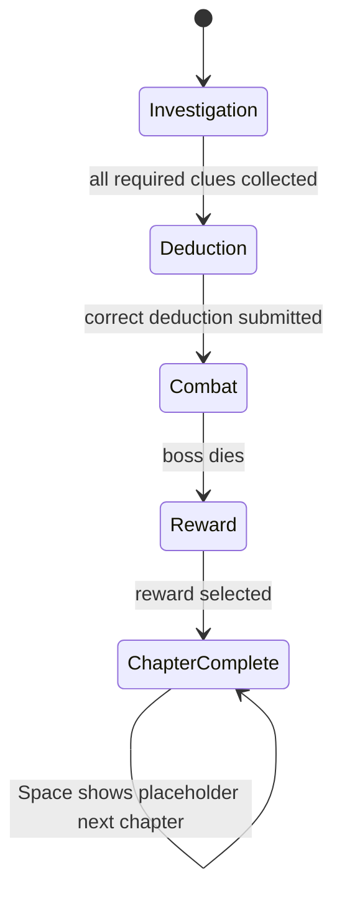
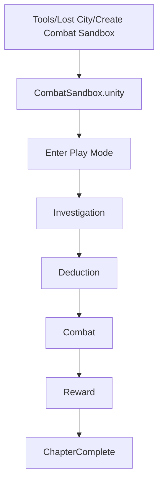
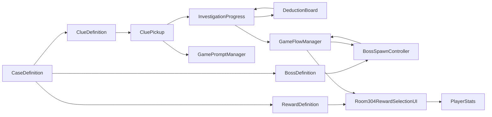

# Architecture

## System Overview

Lost City currently runs as a generated Unity combat sandbox scene with Room 304 investigation and chapter flow layered on top. Phase 5 freezes the demo into a data-driven framework for cases, clues, bosses, rewards, and prompts.

The prototype is intentionally simple:

- One generated scene.
- One playable player.
- One `CaseDefinition` for Room 304.
- One deduction board.
- One boss encounter.
- One reward screen.
- One placeholder next chapter state.

## Manager Overview

| Manager or Controller | Purpose |
| --- | --- |
| `GameFlowManager` | Owns Room 304 state transitions. |
| `InvestigationProgress` | Reads `CaseDefinition`, tracks collected clues, and reports deduction success. |
| `DeductionBoard` | Lets the player choose clues and submit the deduction. |
| `EnemySpawner` | Spawns weighted enemy archetypes during combat. |
| `BossSpawnController` | Reads `BossDefinition`, spawns the boss prefab, and exposes the active boss. |
| `PlayerStats` | Stores player combat and progression stats for the current session. |
| `Room304RewardSelectionUI` | Displays and applies `RewardDefinition` choices. |
| `Room304CompletionUI` | Shows chapter completion and placeholder next chapter text. |
| `GamePromptManager` | Centralizes prototype prompts by prompt type. |
| `CombatSandboxCreator` | Editor automation that generates scene, prefabs, ScriptableObjects, input actions, and references. |

## State Machine

## Scene Flow

## Data Flow

## Dependencies

- Runtime input uses Unity Input System.
- UI uses Unity UI.
- Combat physics uses Unity 2D physics.
- Generated assets are graybox placeholders.
- `CombatSandboxCreator` depends on UnityEditor APIs and only runs in the Editor.

## Subsystem Relationships

- Investigation and deduction are data-driven by `CaseDefinition` and `ClueDefinition`; mystery logic remains handcrafted data.
- Combat starts only after deduction success or debug spawn.
- Rewards are `RewardDefinition` assets and apply to `PlayerStats` or `CombatUpgradeStats`.
- Boss setup is driven by `BossDefinition` plus the boss prefab.
- Prototype prompts route through `GamePromptManager`.
- Chapter progression currently ends at a placeholder state. No Chapter 2 content exists.

## Known Architecture Debt

- `Room304GameStateController` is legacy and should be retired after generated scenes fully migrate to `GameFlowManager`.
- Scene generation still needs a stronger automated validation pass for all serialized references.
- Session persistence exists only in-memory through scene objects. There is no save system.
- `Room304RewardSelectionUI` is now data-driven but still carries a Room304-specific class name.
