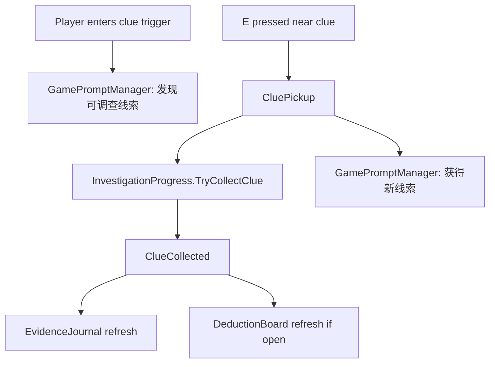

# Event Flow

## Clue Pickup

```text
Trigger
Player enters a clue trigger, then presses E.

System
CluePickup shows a `GamePromptManager` clue prompt, then calls `InvestigationProgress.TryCollectClue()`.

Result
Clue is added, `ClueCollected` fires, `GamePromptManager` shows the collected clue prompt, and journal/deduction UI can refresh.
```



## Journal Update

```text
Trigger
InvestigationProgress.ClueCollected.

System
EvidenceJournal rebuilds text from `ClueDefinition.Name`, `Category`, and `JournalText`.

Result
The journal shows collected clue titles, categories, and descriptions.
```

## Deduction Submission

```text
Trigger
Player clicks 提交推理.

System
DeductionBoard reads `CaseDefinition.DeductionQuestion` and checks `InvestigationProgress.IsCorrectDeduction()`.

Result
Correct deduction displays 真相已重构 and `CaseDefinition.CorrectAnswer`, then marks the case solved.
Incorrect deduction displays 证据还无法成立。
```

## Truth Reconstruction

```text
Trigger
DeductionBoard accepts the selected clues.

System
InvestigationProgress.MarkCaseSolved() raises CaseSolved.

Result
GameFlowManager enters Combat.
```

## Boss Spawn

```text
Trigger
GameFlowManager enters Combat.

System
EnemySpawner is enabled. BossSpawnController receives `CaseDefinition.BossDefinition` and spawns its configured prefab.

Result
The configured boss appears and GameFlowManager tracks its Damageable.Died event.
```

## Boss Death

```text
Trigger
The configured boss Damageable reaches 0 health.

System
GameFlowManager receives Damageable.Died.

Result
Combat stops, remaining enemies are destroyed, and reward UI appears.
```

## Reward Selection

```text
Trigger
Player clicks one reward button.

System
Room304RewardSelectionUI applies the selected `RewardDefinition` to PlayerStats or CombatUpgradeStats.

Result
RewardSelected fires and GameFlowManager enters ChapterComplete.
```

## Level Up

```text
Trigger
PlayerExperience receives enough XP.

System
UpgradeSelectionController shows `RewardDefinition` upgrade choices.

Result
CombatUpgradeStats applies attack speed, attack, or drone projectile rewards from data.
```

## Scene Transition

```text
Trigger
Currently none.

System
ChapterComplete remains in the same scene.

Result
Placeholder text displays 下一章节开发中.
```

## Chapter Completion

```text
Trigger
Reward selected, then Space pressed on the chapter complete screen.

System
Room304CompletionUI raises ContinueRequested.

Result
GameFlowManager logs Room304 Completed and shows the next chapter placeholder.
```
