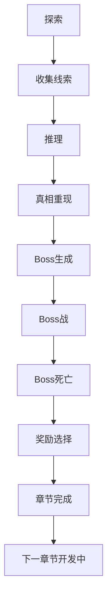

# Gameplay Loop

## Core Loop

## Investigation

The player explores the active case, finds clue pickups, and collects all required clues from `CaseDefinition.Clues`. Collecting the full required clue set moves `GameFlowManager` from `Investigation` to `Deduction`.

## Deduction

The player opens the deduction board, selects collected clues, and submits them. The current MVP requires selecting all required clues exactly. Correct submission shows `真相已重构`, displays `CaseDefinition.CorrectAnswer`, and raises `CaseSolved`.

## Combat

`GameFlowManager` receives `CaseSolved`, disables the deduction board, enables combat spawning, passes `CaseDefinition.BossDefinition` to `BossSpawnController`, and spawns the configured boss.

Combat uses:

- Pistol manual weapon.
- Memory orb automatic weapon.
- Weighted enemy spawning.
- Boss from `BossDefinition`.
- Player stats for damage, crit, defense, dodge, health, and movement.

## Reward

When the boss dies, combat stops, remaining enemies are removed, and the reward screen appears.

Temporary rewards are `RewardDefinition` assets:

- `+10%攻击力`
- `+10%生命值`
- `+5%暴击率`

Rewards modify `PlayerStats` and remain active for the current session.

## Next Chapter

After reward selection, the chapter completion screen appears. Pressing Space shows `下一章节开发中`. This validates chapter progression architecture only. There is no Chapter 2 content.

## Player Progression

Player progression currently has two layers:

- Run XP and level-up choices from combat XP.
- Chapter reward choices after boss death.

There is no save system yet, so progression is not persistent across editor Play Mode sessions.

## Boss Progression

The Room 304 boss is configured through `BossDefinition`. It exists to validate:

- Boss spawn after deduction.
- Boss death event handling.
- Combat shutdown.
- Reward transition.

## Failure States

- Player death uses `PlayerDeathHandler` and restarts after a delay.
- Incorrect deduction submission keeps the player in deduction flow.
- Missing generated references can break UI or scene flow. Use the generator before testing.

## Victory States

- Boss defeated.
- Reward selected.
- Chapter complete screen shown.
- Placeholder next chapter state shown.
