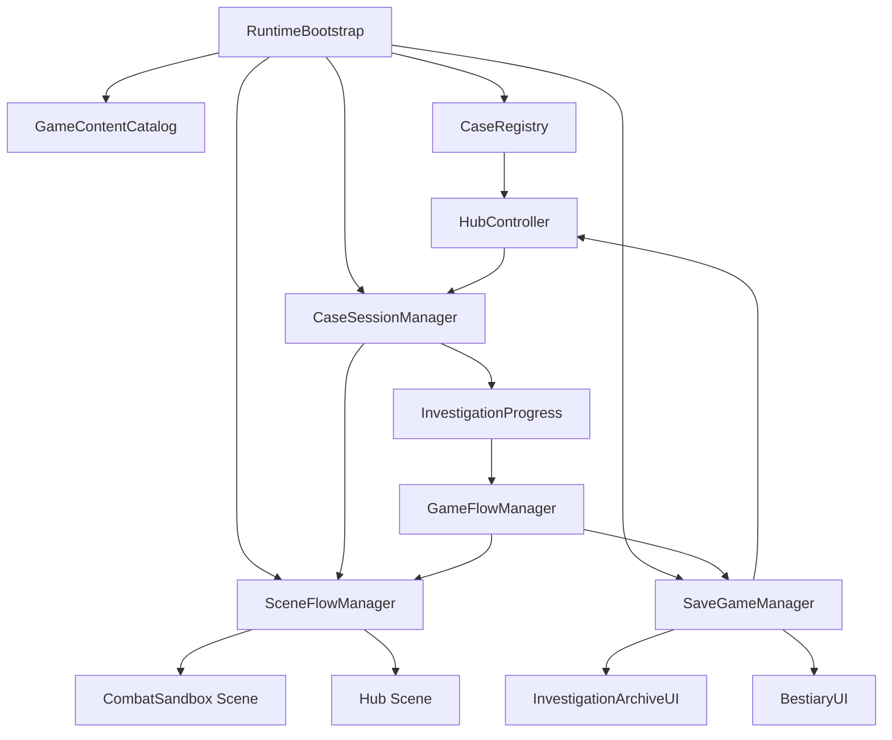
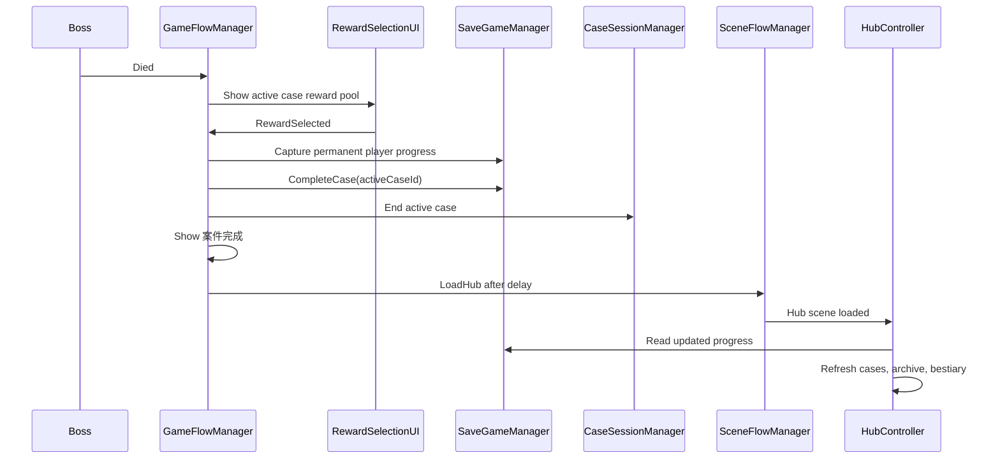

# Phase 6 Meta Framework Design

## Status

Approved design for transforming the Room 304 prototype into a multi-case investigation framework.

This phase changes game structure only. It does not add new bosses, chapters, stories, weapons, art assets, animation, materials, or visual polish.

## Goals

Phase 6 must support this player flow:

```text
进入大厅
-> 选择304号病房
-> 调查与推理
-> Boss战
-> 奖励选择
-> 案件完成
-> 自动返回大厅
-> 案件档案更新
-> 怪物图鉴更新
-> 后续案件解锁
```

The implementation must also make future cases discoverable through data assets without adding case-specific logic to core runtime classes.

## Scope Decisions

### Shared Investigation Scene

All cases use the same generated investigation scene during Phase 6.

The Hub selects a `CaseDefinition`, stores it in persistent runtime session state, and loads `CombatSandbox.unity`. Investigation systems read the selected case from the session instead of relying on a Room 304 reference serialized directly into the scene.

This phase does not introduce per-case scenes, additive scene composition, or a level-authoring framework.

### Placeholder Progression Case

Chapter 1 contains Room 304 followed by one metadata-only placeholder case named `下一案件开发中`.

The placeholder:

- Has no story content, clues, boss, rewards, or playable scene content.
- Exists only to verify sequential unlocking.
- Appears as `未解锁` before Room 304 completion.
- Appears as `已解锁 · 开发中` after Room 304 completion.
- Cannot be started.

This validates progression without creating Chapter 2 or a second playable case.

## Runtime Architecture



### Persistent Runtime

`RuntimeBootstrap` creates one `DontDestroyOnLoad` root before the first scene loads.

The root contains:

- `SaveGameManager`
- `CaseRegistry`
- `CaseSessionManager`
- `SceneFlowManager`

The persistent runtime loads `GameContentCatalog` from `Resources/GameContentCatalog`.

Duplicate runtime roots destroy themselves. Scene objects never own authoritative save or case-selection state.

### Scene Responsibilities

`Hub.unity`:

- Displays chapter progress.
- Displays every registered case and its state.
- Starts playable available cases.
- Displays the investigation archive.
- Displays the bestiary.

`CombatSandbox.unity`:

- Reads the active case from `CaseSessionManager`.
- Executes investigation, deduction, combat, reward, and completion.
- Records clues and bestiary encounters.
- Marks the active case complete.
- Returns to Hub automatically.

## Data Definitions

### CaseDefinition

Existing fields remain:

- `CaseId`
- `CaseName`
- `Description`
- `Clues`
- `DeductionQuestion`
- `CorrectAnswer`
- `BossDefinition`
- `RewardPool`
- `CompletionText`

Phase 6 adds:

- `CaseSummary`: text shown in the investigation archive after completion.
- `IsPlayable`: false for metadata-only placeholders.

Case ordering and sequential unlock rules belong to `ChapterDefinition`, not `CaseDefinition`.

### ChapterDefinition

`ChapterDefinition` is a ScriptableObject containing:

- `ChapterId`
- `ChapterName`
- `Description`
- Ordered `CaseDefinition[] Cases`
- `string[] RequiredCompletedCaseIds`

A chapter is unlocked when all required case IDs are completed. Cases within an unlocked chapter unlock sequentially.

Chapter 1 has no chapter prerequisites and contains:

1. `304号病房`
2. `下一案件开发中`

### EnemyDefinition

Phase 6 adds:

- `EnemyId`
- `BestiaryDescription`

`EnemyId` is the stable save key. Display names may change without invalidating save data.

### BossDefinition

Phase 6 adds:

- `BossId`
- `BestiaryDescription`

`BossId` is the stable save key.

### GameContentCatalog

`GameContentCatalog` is a generated ScriptableObject stored at:

```text
Assets/_Project/Resources/GameContentCatalog.asset
```

It contains references to:

- All `CaseDefinition` assets.
- All `ChapterDefinition` assets.
- All `ClueDefinition` assets.
- All `EnemyDefinition` assets.
- All `BossDefinition` assets.

An Editor `AssetPostprocessor` rebuilds the catalog after relevant ScriptableObject assets are imported, moved, or deleted. `CombatSandboxCreator` also rebuilds it explicitly.

The runtime does not use `AssetDatabase`.

## Case Registry And Progression

### CaseState

```csharp
public enum CaseState
{
    Locked,
    Available,
    Completed
}
```

### State Rules

For a case assigned to a chapter:

1. If its ID is in completed cases, state is `Completed`.
2. If the chapter prerequisites are incomplete, state is `Locked`.
3. The first case in an unlocked chapter is `Available`.
4. Any later case is `Available` only when the previous case is completed.
5. Otherwise the state is `Locked`.

For a catalog case not assigned to a chapter:

- It appears in the Hub under `未归档案件`.
- It is `Available` when playable.
- A non-playable case is displayed but cannot be started.

### Registry Responsibilities

`CaseRegistry`:

- Indexes all catalog entries by stable ID.
- Rejects duplicate or empty IDs with clear Console errors.
- Returns chapter-ordered case views for Hub UI.
- Computes `CaseState`.
- Determines the current chapter.
- Joins saved IDs with data definitions for archive and bestiary display.
- Contains no Room 304 constants.

## Save System

### Save Location

```text
Application.persistentDataPath/lost-city-save.json
```

### SaveGameData

The versioned JSON root contains:

```text
version
completedCaseIds[]
permanentUnlockIds[]
discoveredClueIds[]
encounteredEnemyIds[]
encounteredBossIds[]
playerProgress
```

`playerProgress` contains:

```text
level
currentExperience
experienceToNextLevel
attackMultiplier
maxHpMultiplier
fireRateMultiplier
critChanceBonus
dodgeChanceBonus
droneProjectileBonus
```

Permanent stat values are included because the player object is destroyed when returning to Hub. Without saved stat progression, a selected case reward would be lost during the required scene transition.

### Save Behavior

`SaveGameManager`:

- Loads automatically during runtime bootstrap.
- Creates default version 1 data if no file exists.
- Sanitizes null collections, duplicate IDs, invalid levels, and invalid multipliers.
- Writes after every progression mutation.
- Writes atomically through a temporary file and replacement.
- Preserves unknown future expansion through explicit version migration methods.
- Exposes immutable read access and focused mutation methods.

Mutation methods include:

- `CompleteCase(string caseId)`
- `DiscoverClue(string clueId)`
- `EncounterEnemy(string enemyId)`
- `EncounterBoss(string bossId)`
- `AddPermanentUnlock(string unlockId)`
- `SetPlayerProgress(PlayerProgressData progress)`

All ID collections behave as sets and do not create duplicates.

### Testable Save Boundary

Pure save data, sanitization, ID-set behavior, serialization, and progression rules live in a small `LostCity.Meta.Core` assembly.

The Unity-facing `SaveGameManager` owns filesystem access and delegates data operations to the tested core types.

## Case Session And Scene Flow

### CaseSessionManager

`CaseSessionManager` stores:

- Active case ID.
- Active `CaseDefinition`.
- Whether a case run is active.

Starting a case requires:

- The case exists in `CaseRegistry`.
- Its state is `Available` or `Completed`.
- `IsPlayable` is true.

Completed cases may be replayed. Replay does not duplicate completion, clues, unlocks, or bestiary entries.

### SceneFlowManager

`SceneFlowManager` owns generic scene names:

- `Hub`
- `CombatSandbox`

It exposes:

- `LoadHub()`
- `StartCase(CaseDefinition definition)`

Scene names are framework configuration, not case-specific logic.

### Investigation Injection

`InvestigationProgress` resolves the active case from `CaseSessionManager` during initialization. Its serialized `caseDefinition` remains as an Editor fallback for direct scene testing.

`GameFlowManager` begins after investigation initialization and logs generic case IDs and names rather than `Room304 Started` or other hardcoded Room 304 messages.

## Completion And Return Flow



The completion UI is renamed to a generic case completion controller.

Behavior:

- Shows `案件完成`.
- Shows active case completion text.
- Shows `正在返回大厅`.
- Returns automatically after approximately three seconds.
- Space requests an immediate return.

The old `下一章节开发中` terminal state is removed from the active flow.

## Player Progression Persistence

When an investigation scene starts:

1. Load saved player level and XP into `PlayerExperience`.
2. Apply saved permanent stat modifiers to `PlayerStats`.
3. Apply saved drone projectile bonus to `CombatUpgradeStats`.

When XP, level, permanent reward, or chapter reward changes:

1. Capture current permanent progression.
2. Update `SaveGameData.playerProgress`.
3. Save automatically.

Run-only state such as current HP, spawned enemies, and pending level-up UI is not saved.

## Investigation Archive

`InvestigationArchiveUI` reads only from `CaseRegistry` and `SaveGameManager`.

It displays:

- Completed case name.
- `CaseSummary`.
- Collected clues belonging to that case.
- Each clue's name, category, and journal text.

Locked and incomplete cases do not reveal their summary or undiscovered clues.

All content comes from `CaseDefinition` and `ClueDefinition`.

## Bestiary

`BestiaryUI` joins saved encounter IDs with catalog definitions.

It displays:

- Encountered enemy display name and description.
- Encountered boss name and description.
- Undiscovered entries as `未知记录`.

Encounter recording:

- `MemoryFragmentEnemy` records its `EnemyDefinition.EnemyId` when initialized or enabled for combat.
- `BossSpawnController` records `BossDefinition.BossId` when the boss spawns.

Repeated encounters do not duplicate entries or writes when state is unchanged.

## Hub UI

The graybox Hub uses Unity UI and contains:

- Header: `迷城大厅`
- Current chapter text: `章节进度`
- Case list
- Case status labels: `已完成`, `已解锁`, `未解锁`
- Archive tab/button: `案件档案`
- Bestiary tab/button: `怪物图鉴`

Each case row displays:

- Case name.
- Case description.
- Case state.
- Start/replay button when playable.

Locked and metadata-only case buttons are disabled.

The Hub contains no Room 304-specific fields or button listeners. Rows are created from registry view data.

## Editor Automation

The existing menu remains:

```text
Tools/Lost City/Create Combat Sandbox
```

Phase 6 expands it to create or update:

- `Hub.unity`
- `CombatSandbox.unity`
- Chapter 1 definition
- Placeholder case definition
- Game content catalog
- Runtime UI references
- Build Settings with Hub first and CombatSandbox second

Generation remains idempotent.

The generator may seed Room 304 content assets, but runtime managers and Hub UI may not contain Room 304-specific branches.

## Chinese-First UI

All new visible UI text is Simplified Chinese.

Required labels include:

- `迷城大厅`
- `章节进度`
- `案件档案`
- `怪物图鉴`
- `案件完成`
- `返回大厅`
- `正在返回大厅`
- `已完成`
- `已解锁`
- `未解锁`
- `开发中`
- `未知记录`

Code identifiers and asset filenames remain English.

## Error Handling

- Missing catalog: log an error and create an empty runtime registry; Hub shows `未发现案件配置`.
- Invalid or duplicate IDs: log each invalid definition and exclude ambiguous entries.
- Corrupt save JSON: back up the corrupt file, create default save data, and continue.
- Missing active case in investigation scene: log an error and return to Hub.
- Missing case boss or clues: prevent starting the case and display `案件配置不完整`.
- Missing save entry definitions: retain saved IDs but display them as unavailable legacy entries.
- Scene load failure: log the target scene and keep the current scene active.

## Tests

EditMode tests cover the testable Meta Core:

- Empty save creates valid defaults.
- Save sanitization removes duplicate and blank IDs.
- Serialization round-trip preserves all required fields.
- Completed cases remain completed.
- First case in an unlocked chapter is available.
- Later case remains locked until the previous case completes.
- Chapter prerequisite cases lock and unlock the chapter.
- Placeholder case becomes available after Room 304 completion but remains non-startable.
- Repeated clue and bestiary records remain unique.
- Current chapter selection returns the first unlocked incomplete chapter.

Static and compile verification cover Unity-facing integration.

Manual Play Mode verification remains the user's responsibility:

1. Start in Hub.
2. Select Room 304.
3. Complete investigation, deduction, boss, and reward.
4. Observe automatic Hub return.
5. Confirm Room 304 shows completed.
6. Confirm placeholder case shows unlocked and development-only.
7. Confirm archive contains Room 304 and collected clues.
8. Confirm bestiary contains encountered enemy and boss entries.
9. Stop and restart Play Mode.
10. Confirm saved state reloads.

## Documentation Impact

Implementation completion must update:

- `README.md`
- `Docs/Architecture.md`
- `Docs/EventFlow.md`
- `Docs/GameplayLoop.md`
- `Docs/FolderStructure.md`
- `Docs/DeveloperOnboarding.md`
- `Docs/Roadmap.md`
- `Docs/PhaseReport.md`
- Relevant `Docs/API/*.md`

## Out Of Scope

- Additional playable cases.
- Chapter 2.
- New story text beyond generic placeholder metadata.
- New bosses, enemies, weapons, or rewards.
- Per-case scenes.
- Additive scene loading.
- Save slots or cloud saves.
- Save encryption.
- Final UI layout, art, animation, VFX, materials, or audio.
