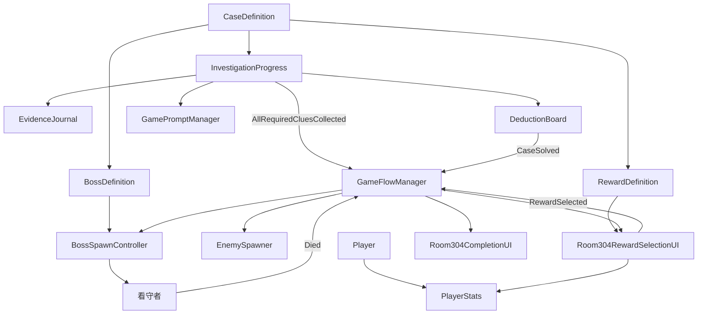

# Lost City

**Genre:** Mystery Puzzle + Roguelike Action
**Engine:** Unity 2022 LTS
**Current Development Phase:** Phase 5, Framework Freeze

Lost City is a Unity prototype for a single-player game that combines investigation, deduction, and lightweight roguelike combat. The current goal is not final content or polish. The current goal is to freeze the current demo into a data-driven framework for cases, clues, bosses, rewards, and prompts.

## Project Overview

Lost City is built around unstable memory spaces. Players explore a location, collect clues, reconstruct a truth, fight a manifestation of that truth, then carry progression forward.

The first playable chapter prototype is **Room 304**. It uses graybox assets and placeholder UI to validate architecture before expanding story, art, or puzzle complexity.

## Current Playable Features

- Top-down player movement and mouse aiming.
- Manual pistol weapon.
- Automatic memory orb weapon.
- Enemy spawning and enemy archetypes.
- The Warden boss prototype.
- Health, damage, crit, dodge, XP, and level data through `PlayerStats`.
- World-space health bars and combat HUD.
- Room 304 clue pickups.
- Evidence journal.
- Deduction board.
- Truth reconstruction event.
- Boss spawn after deduction success.
- Boss death flow.
- Reward selection after boss death.
- Chapter complete screen.
- Placeholder next chapter state.
- Data-driven `CaseDefinition`.
- Data-driven `ClueDefinition`.
- Data-driven `BossDefinition`.
- Data-driven `RewardDefinition`.
- Unified `GamePromptManager`.

## Controls

| Action | Input |
| --- | --- |
| Move | WASD or Arrow Keys |
| Aim | Mouse position |
| Fire pistol | Left Mouse Button |
| Interact with clue | E |
| Toggle evidence journal | J |
| Toggle deduction board | Tab |
| Continue after chapter complete | Space |
| Debug: unlock all clues | F1 |
| Debug: spawn boss | F2 |
| Debug: kill boss | F3 |

## How To Run

1. Open the project with Unity 2022 LTS. The last used editor version is `2022.3.32f1`.
2. Regenerate the playable sandbox:

   ```text
   Tools > Lost City > Create Combat Sandbox
   ```

3. Open the generated scene:

   ```text
   Assets/_Project/Scenes/CombatSandbox.unity
   ```

4. Press Play.

The generator rebuilds the Combat Sandbox scene, prefabs, ScriptableObjects, input actions, UI references, and Room 304 flow objects.

## Latest Architecture Diagram



## Core Gameplay Loop

```text
探索
  -> 收集线索
  -> 推理
  -> 真相重现
  -> Boss生成
  -> Boss战
  -> Boss死亡
  -> 奖励选择
  -> 章节完成
  -> 下一章节开发中
```

## Folder Structure Summary

```text
Assets/_Project/
|-- Art/CombatSandbox/Generated
|-- Code/CombatSandbox
|   |-- Camera
|   |-- Core
|   |-- Debug
|   |-- Editor
|   |-- Enemies
|   |-- Feedback
|   |-- Investigation
|   |-- Pickups
|   |-- Player
|   |-- Progression
|   |-- Spawning
|   |-- UI
|   `-- Weapons
|-- Prefabs/CombatSandbox
|-- Scenes
|-- ScriptableObjects/CombatSandbox
`-- Settings/Input

Docs/
|-- API
|-- Architecture.md
|-- DeveloperOnboarding.md
|-- EventFlow.md
|-- FolderStructure.md
|-- GameplayLoop.md
|-- README.md
`-- Roadmap.md
```

Full folder documentation lives in [Docs/FolderStructure.md](Docs/FolderStructure.md).

## Current Roadmap

1. Regenerate the sandbox with Phase 5 data assets.
2. Verify generated scene and all UI interactions in Unity Play Mode.
3. Clean stale generated scene and prefab changes after successful regeneration.
4. Add stronger automated validation for generator-created references.
5. Add future cases through ScriptableObject data and prefabs, not core code edits.
6. Add Chapter 2 content only after the data-driven Room 304 framework is validated end to end.

See [Docs/Roadmap.md](Docs/Roadmap.md) for details.

## Known Issues

- Unity batchmode scene generation can fail locally if Unity licensing IPC is unavailable. Use the Unity Editor menu generator when that happens.
- Current generated assets may be stale until `Tools > Lost City > Create Combat Sandbox` is run after code updates.
- `Room304GameStateController` is legacy and should not be used by newly generated scenes.
- No save system exists yet, so progression persists only during the current play session.
- Room 304 is architecture validation content, not final story content.
- Unity response files may not include newly added scripts until the Unity Editor imports them.

## Documentation

Documentation is a first-class deliverable for this project. Start here:

- [Docs/README.md](Docs/README.md)
- [Docs/Architecture.md](Docs/Architecture.md)
- [Docs/GameplayLoop.md](Docs/GameplayLoop.md)
- [Docs/EventFlow.md](Docs/EventFlow.md)
- [Docs/DeveloperOnboarding.md](Docs/DeveloperOnboarding.md)
- [Docs/Roadmap.md](Docs/Roadmap.md)

## License

License placeholder. No final license has been selected.
